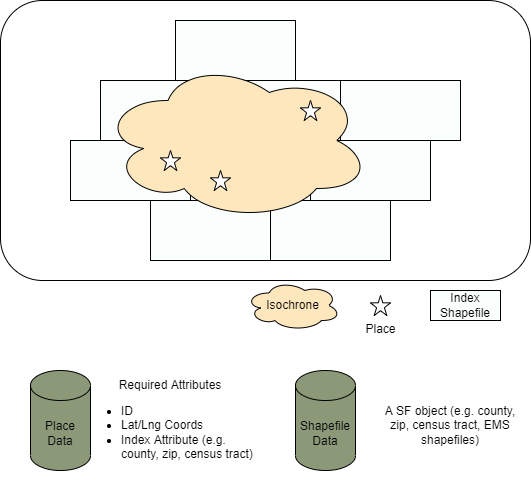

```{r, include = FALSE}
knitr::opts_chunk$set(
  collapse = TRUE,
  comment = "#>"
)
```


# Accessible Resource

Once recieved an irregular isochrone shapefile from OSM service, we want to have all of the resources located within that region. We need to have

- ISO shapefile (sf)
- Indexing shapefile (sf)
- Places Dataset (pre-geocoded with the indexing shapefile)



For example, we used the census tract shapefile as the indexing shapefile. The places dataset needs pre-geocoded and has the attribute `census_tract` for filtering. 

## Step I: Find Overlaps

```{r eval = FALSE}

overlap_index <-
    sf::st_intersects(
      iso_sf,
      index_sf
    ) %>% unlist()

  overlap_object <-
    index_sf[overlap_index, ][[index_sf_key]]
```

The code above helps us find all the census tracts that overlap with the isochrone. 


## Step II: Indexing

Now, we create a subset with all places in the overlapped census tracts. 
```{r eval = FALSE}
resource_filtered_tbl <-
    resource_tbl %>%
    dplyr::filter(.data[[resource_tbl_key]] %in% overlap_object) %>%
    dplyr::collect()
```


The obtained places might still be out of the isochrone boundaries. The following step helps us get to the places within the isochrone. 


```{r eval = FALSE}

resource_index <-
    sf::st_contains(
      iso_sf,
      sf::st_as_sf(
        resource_filtered_tbl,
        coords = resource_tbl_coords
      ) %>%
        sf::st_set_crs(value = 4326)
    ) %>% unlist()

resource_filtered_tbl[resource_index, ]
```


## Functions


``` {r eval = FALSE}

emthub::pull_iso_resource(
  iso_sf,
  index_sf = get_sf_ct(parquet = TRUE),
  index_sf_key = "GEOID",
  resource_tbl,
  resource_tbl_key = "Census_Tract",
  resource_tbl_coords = c("longitude", "latitude")
)

```


